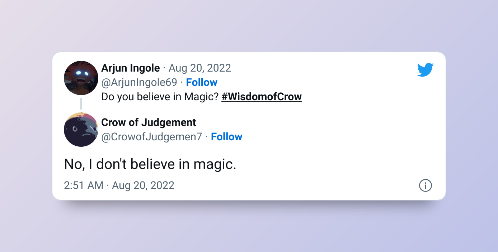

# Crow Of Judgement


## What is this?
Crow of Judgement as I like to call it, Is a Twitter bot that replies to all tweets with the hashtag (#WisdomOfCrow) with the text generated using OpenAI's GPT-3 davinci model.

## How to use?
Just Tweet something with the #WisdomofCrow, The will reply you as soon as possible.


## Example Tweet

### The Reply


# Deploy on Heroku
[](https://dashboard.heroku.com/new?template=https://github.com/Arjun-Ingole/CrowofJudgement)

Click on the Button Above and fill out the information.

## Enviornment Variables
```
OPENAI_API_KEY
CONSUMER_KEY
CONSUMER_SECRET 
ACCESS_TOKEN 
ACCESS_TOKEN_SECRET
HASHTAG
```

Get keys from OpenAI and Twitter.

Hashtag, Set any hashtag you want. (No need to include '#')

## Libraries Used
- OpenAI
- Tweepy